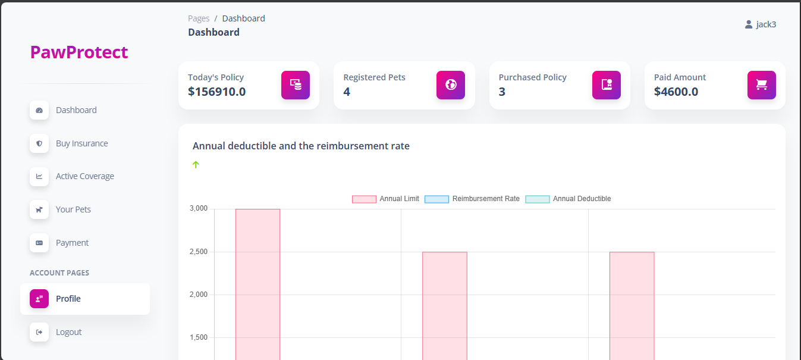
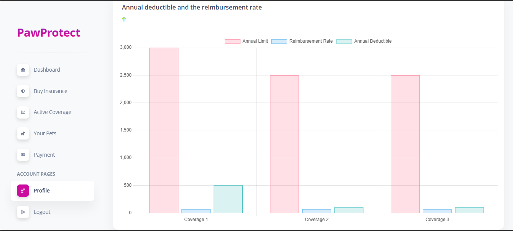
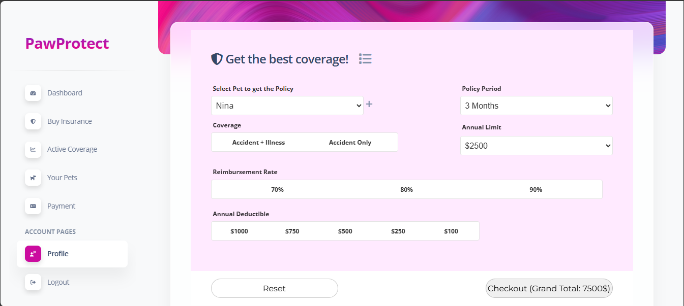
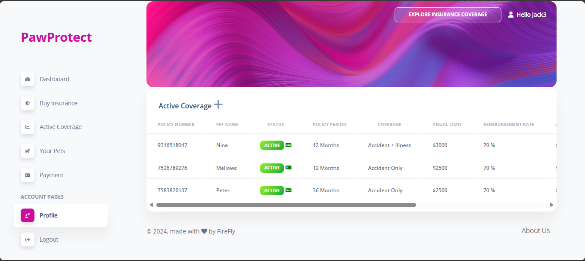
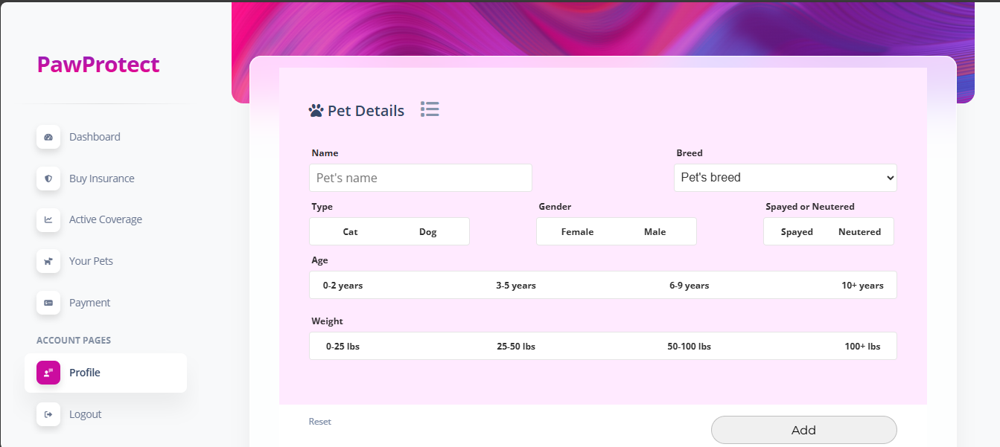
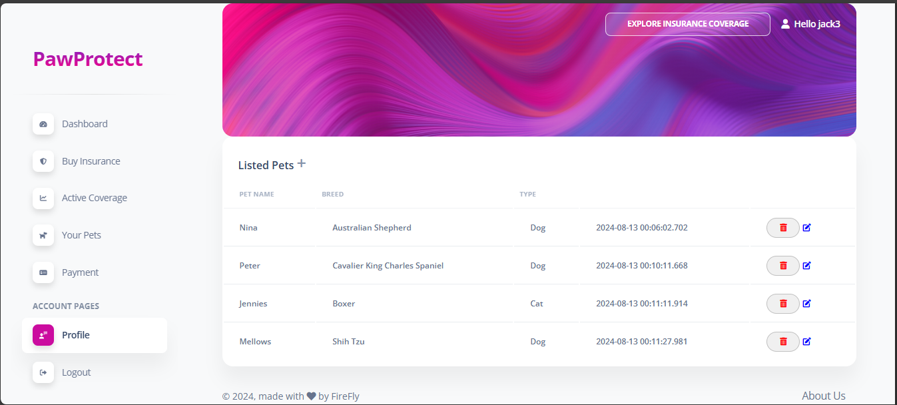
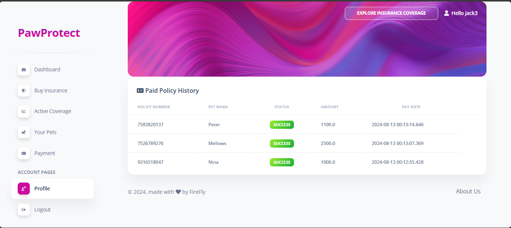

PawProtect is Demo Pet insurance Project

1. Set MySQL credentials in application.yml

   url: jdbc:mysql://localhost:3306/ml_pet_insurance_v2?createDatabaseIfNotExist=true
   username: root
   password: root

2. Install Dependency of pom.xml

3. run Application:
   
    javac Application.java
    

Hope this code help you! 